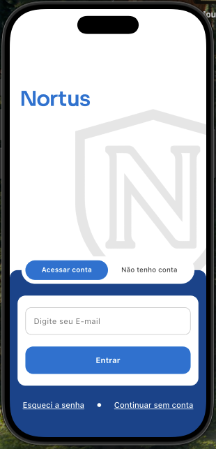
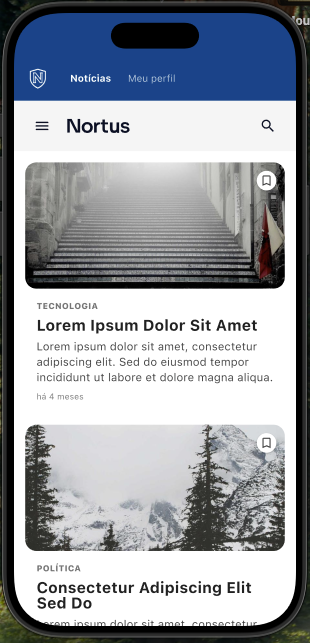
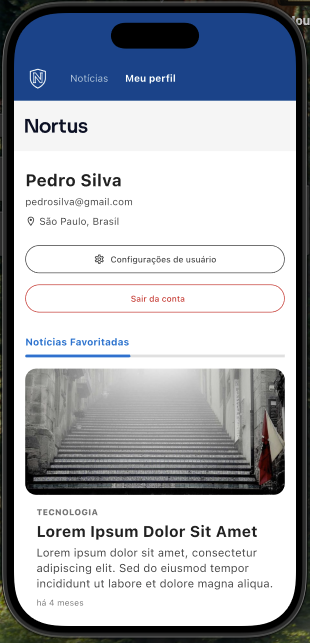
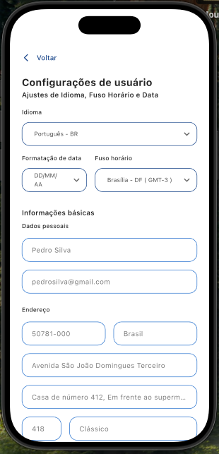

# Desafio Loomi - Noctus

Projeto técnico desenvolvido para o desafio Flutter da Loomi/Noctus. O aplicativo consiste em uma plataforma de notícias com autenticação de usuários, listagem de notícias, detalhes e perfil do usuário com persistência offline.

## 📸 Imagens do Projeto

<p align="center">
  
  
  
  
  
  
</p>

## 🔐 Acesso ao App

Para acessar as funcionalidades do aplicativo, utilize as seguintes credenciais:

- **E-mail:** `desafioLoomi@gmail.com`
- **Senha:** `senha123`

## 🏗️ Arquitetura

O projeto foi estruturado seguindo os princípios da **Clean Architecture**, visando a separação de responsabilidades e facilidade de manutenção/testes.

A estrutura de pastas principal é organizada da seguinte forma:

```text
lib/
├── main.dart                        # Ponto de entrada, inicializa injeção de dependência e cache
├── app.dart                         # Configuração global do MaterialApp, Router e Temas
└── modules/
    ├── commons/                     # Módulo compartilhado com recursos globais
    │   ├── config/                  # Configurações (Rotas, Injeção de Dependências, URLs)
    │   └── utils/                   # Utilitários, Helpers e Recursos globais
    │       ├── cache/               # Gerenciamento de persistência de dados local
    │       ├── errors/              # Padronização de erros e exceções
    │       ├── extensions/          # Extensões para facilitar o uso de classes nativas
    │       ├── guards/              # Proteção de rotas e validações de acesso
    │       ├── helpers/             # Funções de auxílio geral para o app
    │       ├── resources/           # Definições de cores, fontes e estilos (Design System)
    │       ├── states/              # Estados genéricos compartilhados pela aplicação
    │       └── validators/          # Lógica de validação de campos e formulários
    └── module_name/                 # Estrutura modularizada por funcionalidade
        ├── core/
        │   ├── data/
        │   │   ├── data_sources/    # Implementações de acesso a dados (Remote/Local)
        │   │   ├── models/          # Modelos de dados (extensões de entities para serialização)
        │   │   └── repositories/    # Implementações dos repositórios
        │   └── domain/
        │       ├── entities/        # Objetos de negócio puros
        │       ├── repositories/    # Contratos (interfaces) dos repositórios
        │       └── usecases/        # Regras de negócio da aplicação
        └── presentation/
            ├── bloc/                # Gerenciamento de estado (Bloc/Cubit)
            ├── views/               # Telas do aplicativo
            └── components/          # Componentes específicos do módulo
```

### Justificativas Técnicas
- **CORE vs PRESENTATION**: Priorizei o desenvolvimento da camada `CORE` (Data e Domain) antes da `PRESENTATION` para garantir que a lógica de negócio e integração de dados estivessem sólidas antes de construir a interface.
- **Sqflite**: Escolhido para a persistência local por ser uma solução robusta (SQL) que permite consultas complexas e um controle maior sobre o esquema do banco de dados, ideal para o cache de notícias offline.
- **GoRouter**: Utilizado para navegação devido à sua flexibilidade, suporte excelente para deep links e por ser uma recomendação do desafio.

## 🛠️ Tecnologias e Bibliotecas

O projeto utiliza as seguintes tecnologias principais:

- **Flutter:** 3.38.7
- **Dart:** 3.10.7
- **flutter_bloc:** Gerenciamento de estado.
- **get_it:** Injeção de dependências.
- **dio:** Consumo de APIs REST.
- **go_router:** Sistema de rotas.
- **sqflite:** Banco de dados local para persistência offline.
- **shared_preferences:** Cache de dados simples e persistência do usuário.
- **equatable:** Comparação de objetos.

## 🚀 Rodando o Projeto

Após clonar o repositório e navegar até a pasta do projeto:

1. Obtenha as dependências:
   ```bash
   flutter pub get
   ```

2. Execute o projeto:
   Se houver mais de um dispositivo conectado:
   ```bash
   flutter run -d <deviceID>
   ```
   Caso contrário:
   ```bash
   flutter run
   ```

## 📋 Gestão de Atividades

O acompanhamento das tarefas e o backlog do projeto foram gerenciados no **Trello**:
[Acesse o Quadro do Projeto](https://trello.com/invite/b/697cea39b873eebe09557395/ATTI77837fefbeb3620b6d933393c1cec7479730300F/nortus-desafio-loomi-flutter)

## 🧠 Dificuldades e Aprendizados

- **GoRouter & Sqflite**: Embora tenha tido pouco contato prévio com ambas em alguns contextos específicos, a integração foi fluida. Utilizei a documentação oficial e recursos da comunidade para resolver desafios pontuais de navegação e estruturação das tabelas do banco de dados.
- **Offline First**: Implementar a sincronização entre dados remotos e locais exigiu uma atenção extra para garantir uma experiência de usuário (UX) consistente mesmo sem conexão.

## 🔮 O que faria diferente?

Em um contexto exploratório ou com mais tempo:
- **Interfaces e Abstrações**: Criaria mais interfaces e abstrações para as camadas de dados, como no caso do Sqflite que não foi abstraído completamente, permitindo uma troca mais fácil de provedores de banco de dados se necessário.
- **Testes Unitários e Integração**: Aplicaria uma cobertura de testes em todas as camadas.
- **Design System**: Refinaria ainda mais os componentes para extrair o máximo de reusabilidade.

